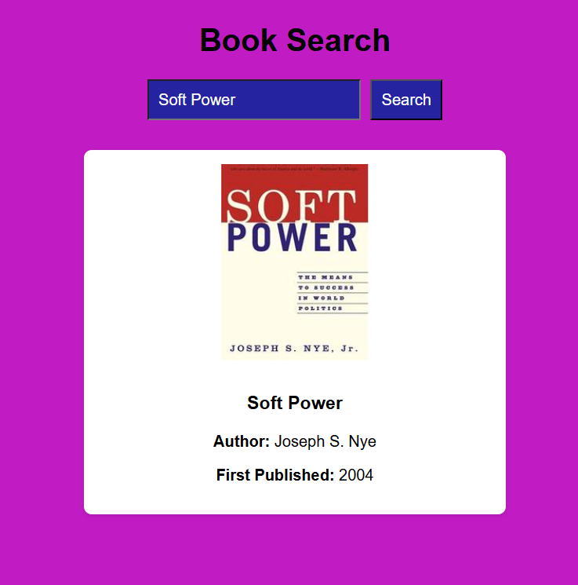
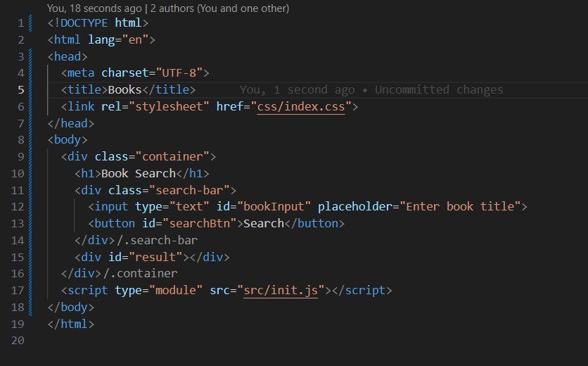

# Books
> The **Books** project allows users to search for books by title using the Open Library API. When a user enters a book title, the app fetches and displays key information such as the book's image, name, author(s), and first publication year and language. This is a simple and interactive way to explore book data from a vast, open-source library.

- [Books](#books)
  - [General Info](#general-info)
  - [Screenshots](#screenshots)
  - 
  - [Code Example](#code-example)
  - [Technologies](#technologies)
  - [Status](#status)
  - [Inspiration](#inspiration)
  - [Contact](#contact)

---

## General Info

> This project allows users to search for books by title, fetching real-time data using the Open Library API. It provides basic information about the book, including its cover image, title, author(s), and first publication year. This project is a great way to practice working with external APIs, asynchronous JavaScript, and building modular, maintainable web applications.

---

## Screenshots

---

## Code Example

---

## Technologies

- HTML5
- CSS3 (Flexbox)
- JavaScript (ES Modules)
- [Open Library API](https://openlibrary.org/search.json?title=)
- Git & GitHub
- VS Code (Editor)

---

## Status

**Project Completed**

---

## Inspiration

Built as part of a personal learning project to enhance skills in API integration, asynchronous programming, and front-end development with modern JavaScript.  

---

## Contact

**Sajid Hussain**  

[GitHub Profile](https://github.com/SajidHussainabbasi)
