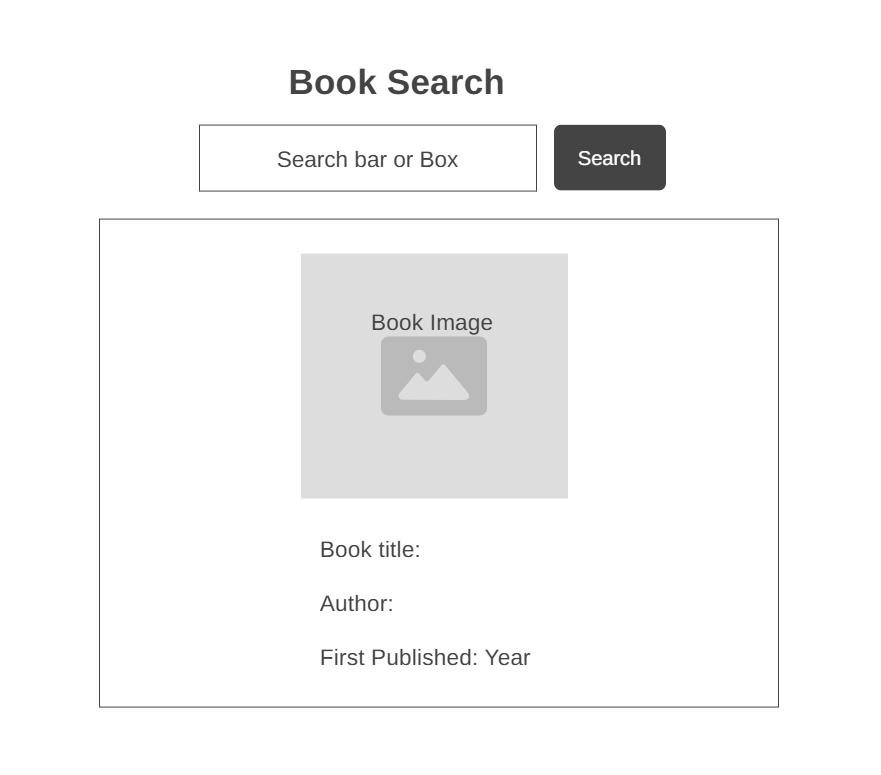

# Design

## Project's Design Overview

The **Books** web application provides a simple and interactive way for users to search and view book information using the [Open Library API](https://openlibrary.org/developers/api). It displays the book’s title, author(s), first publication year, and cover image.

- **Clean & Focused UI**: Simple interface with a centered search bar and results.
- **Responsive Layout**: Works smoothly on both desktop and mobile devices.
- **Modular Code Structure**: Divides logic into API calls, UI rendering, event listeners, and handlers.
- **User-Friendly Search**: Supports search by button click or "Enter" key press.

---

## Wireframe  

